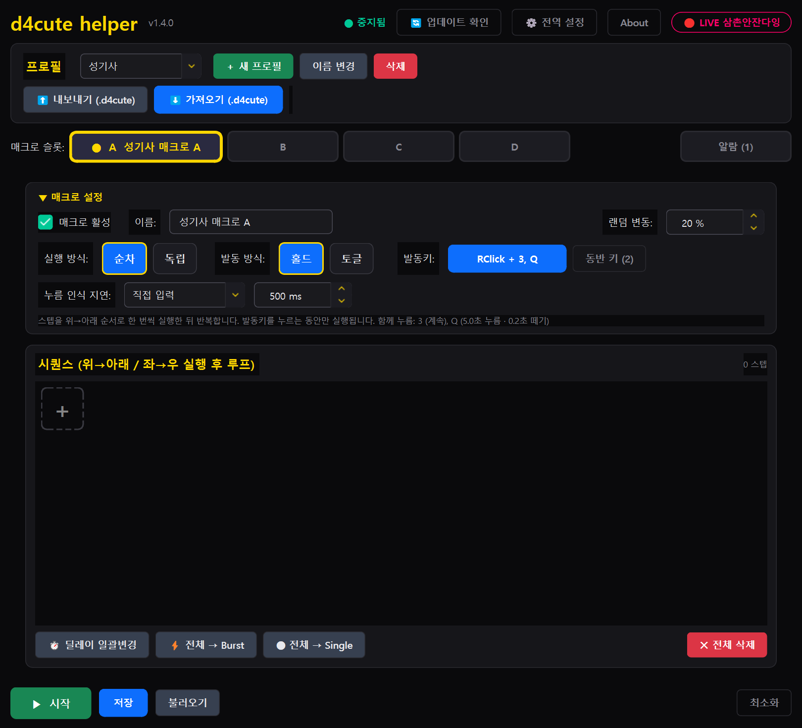
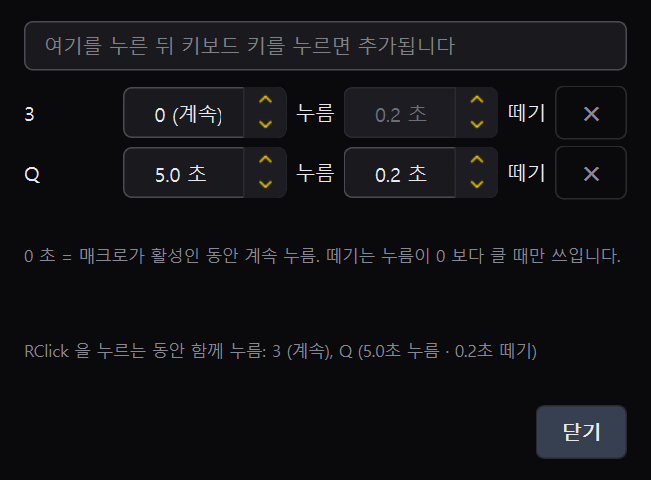
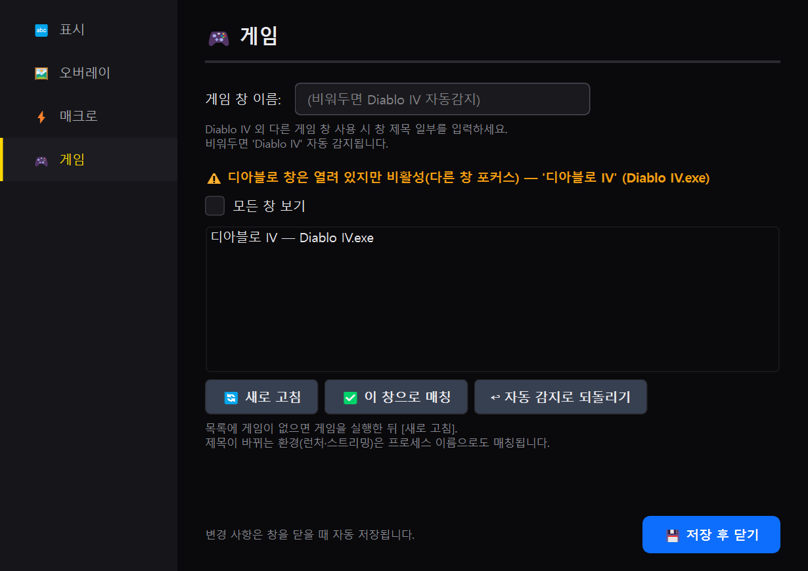
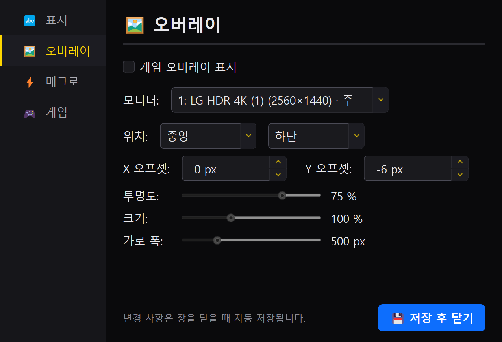
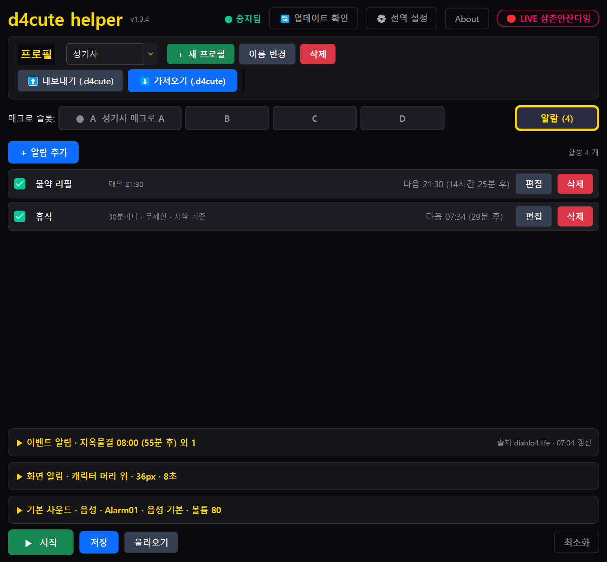
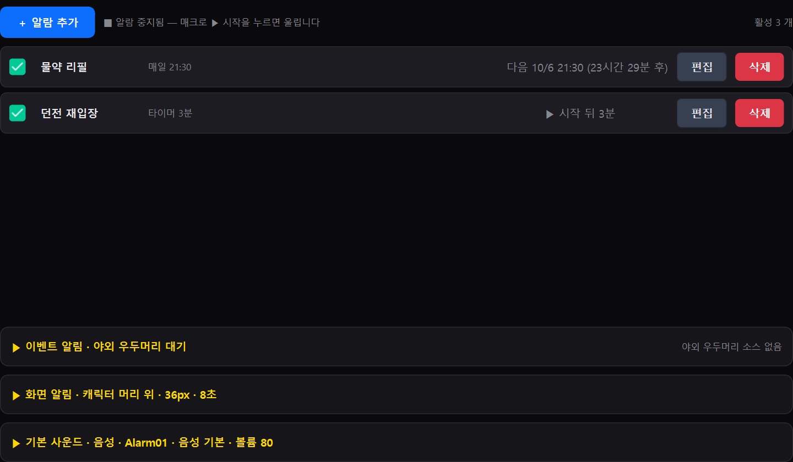
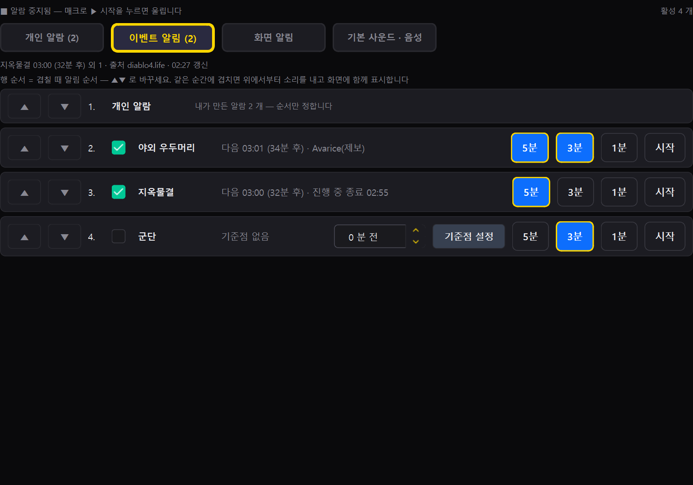
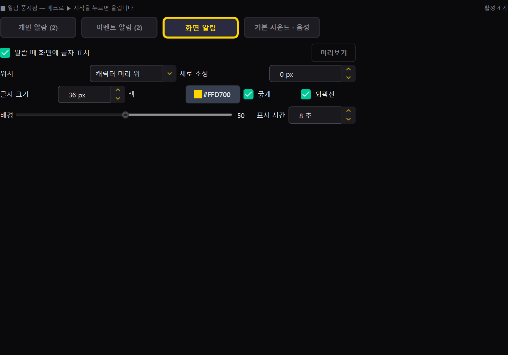
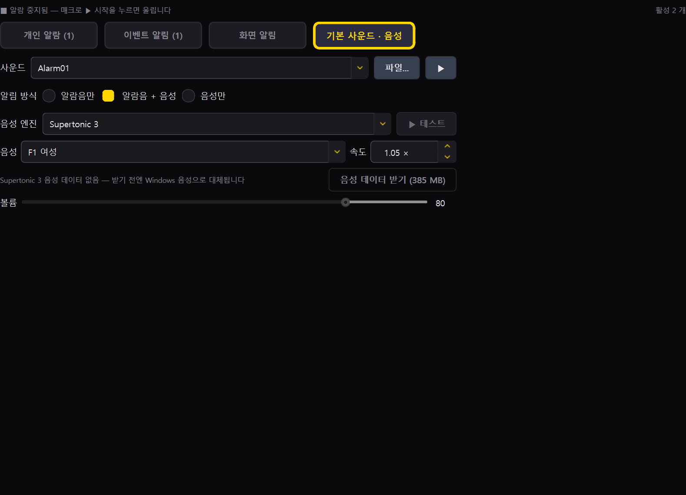
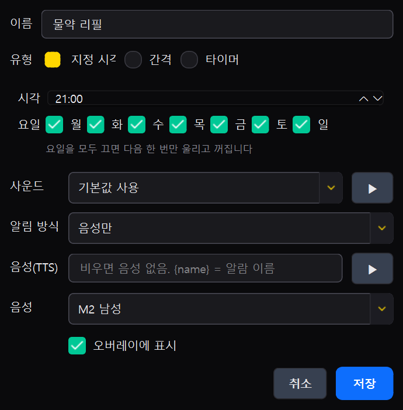

# D4 Help — d4cute helper 다운로드 · 기능 설명 · 디아블로 4 문서

디아블로 4 매크로 도우미 **d4cute helper** 의 최신 버전, 기능 설명, 클랜 프로필 공유, 시즌 문서를 한곳에 모았습니다.

**짧은 주소: https://da.gd/d4help** (이 페이지로 바로 옵니다 — 클랜원에게 이 주소를 알려 주세요)

## 🎬 헬퍼 사용방법 영상

설치부터 매크로 · 대기 키 · 알람 · 음성 알림 · 오버레이까지 한 번에 보는 영상입니다. 썸네일을 누르면 YouTube 로 이동합니다.

▶ **https://youtu.be/Ff7MBqD4WaI** · 글로 보려면 아래 [기능 설명](#기능-설명) 으로.

## 🙋 버그 · 질문 · 사용 팁은 여기로

| 무엇을 올리나 | 바로가기 | 모아 보기 |
|---|---|---|
| 🐛 헬퍼가 이상하게 동작한다 | **[버그 신고](https://github.com/nimto/d4help/issues/new?template=bug-report.yml)** | [버그 목록](https://github.com/nimto/d4help/issues?q=label%3A버그) |
| ❓ 사용법 · 설정이 궁금하다 | **[질문하기](https://github.com/nimto/d4help/issues/new?template=question.yml)** | [답변 완료된 질문](https://github.com/nimto/d4help/issues?q=label%3A%22답변+완료%22) |
| 💡 좋은 설정 · 플레이 팁을 나누고 싶다 | **[사용 팁 올리기](https://github.com/nimto/d4help/issues/new?template=tip.yml)** | [사용 팁 목록](https://github.com/nimto/d4help/issues?q=label%3A%22사용+팁%22) |
| 📦 내 매크로 프로필을 공유한다 | **[프로필 공유](https://github.com/nimto/d4help/issues/new?template=profile-share.yml)** | [프로필 목록](https://github.com/nimto/d4help/issues?q=label%3A%22프로필+공유%22) · [프로필/](./프로필/README.md) |
| 🖥️ 혼자 설정하기 어렵다 (원격 지원) | **[원격 지원 안내](ANYDESK_GUIDE.md)** | [애니데스크 가이드](ANYDESK_GUIDE.md) |

GitHub 계정만 있으면 누구나 올릴 수 있습니다. 질문에 답이 달리면 **답변 완료** 라벨이 붙습니다. 전체 목록은 [Issues](https://github.com/nimto/d4help/issues).

## 다운로드

| 파일 | 설명 |
|---|---|
| **[d4cute_helper_setup.exe](https://github.com/nimto/d4help/releases/latest/download/d4cute_helper_setup.exe)** | 설치 버전 (권장). 설치 후 자동 업데이트가 동작합니다. |
| [d4cute_helper.exe](https://github.com/nimto/d4help/releases/latest/download/d4cute_helper.exe) | 설치 없이 바로 실행하는 포터블 버전. |

위 두 링크는 항상 **가장 최신 릴리스**의 파일로 연결됩니다. 버전별 파일과 변경 내용은 [릴리스 목록](https://github.com/nimto/d4help/releases)에서 볼 수 있습니다.

## 설치 · 실행

1. `d4cute_helper_setup.exe` 를 받아 실행합니다. 관리자 권한은 필요 없습니다.
2. Windows SmartScreen 경고가 뜨면 **추가 정보 → 실행** 을 누릅니다(서명되지 않은 개인 배포 파일이라 뜨는 경고입니다).
3. 설치가 끝나면 시작 메뉴의 **d4cute helper** 로 실행합니다. 새 버전이 나오면 앱이 알려 주고 바로 업데이트할 수 있습니다.
4. 요구 사항: Windows 10 / 11. 디아블로 4 는 **창 모드 또는 테두리 없는 창**으로 두면 오버레이와 화면 알림이 보입니다(배타 전체화면에서는 보이지 않음).
5. 설치나 초기 설정이 잘 안 풀리면 **[애니데스크 원격 지원](ANYDESK_GUIDE.md)** 을 통해 도움을 받으실 수 있습니다.

## 기능 설명

*메인 화면: 프로필 카드, 매크로 슬롯 A~D, 매크로 설정(발동키 `RClick + 3, Q` · 동반 키 버튼), 시퀀스*

### 매크로 슬롯 A · B · C · D

- 슬롯마다 이름과 켜기/끄기, **실행 방식**(순차 = 스텝을 위→아래 반복 / 독립 = 스텝마다 자기 딜레이로 따로 반복), **발동 방식**(홀드 = 누르는 동안만 / 토글 = 한 번 누르면 켜짐·꺼짐)을 정합니다.
- **발동키**는 키보드 키나 마우스 버튼(오른쪽 클릭 등)이고 Ctrl · Shift · Alt 조합도 됩니다. 홀드 방식은 **누름 인식 지연**(즉시 · 짧게 · 길게 · 직접 입력)으로 오동작을 줄입니다.
- **랜덤 변동(%)** 을 주면 딜레이가 매번 조금씩 달라집니다.

#### ⚠️ 오른쪽 마우스를 발동키로 쓸 때 — 인벤토리 · 창고에서 창이 닫히지 않게

오른쪽 클릭은 게임 안에서 **아이템 착용 · 창고 넣기 · 재료 분해** 같은 조작에도 쓰입니다. 발동키가 오른쪽 마우스이고 **누름 인식 지연이 즉시(0 ms)** 이면, 인벤토리에서 아이템을 우클릭하는 그 짧은 클릭에도 매크로가 켜져 스킬 키가 눌리고 **열려 있던 창이 닫혀 버립니다**.

| 설정 | 효과 |
|---|---|
| 누름 인식 지연 **즉시 (0 ms)** | 클릭하자마자 매크로 시작 — 인벤토리 우클릭에도 켜짐 |
| **짧게 (100 ms)** | 0.1 초 넘게 누르고 있어야 시작 — 보통의 우클릭(착용 · 창고 넣기)은 그보다 짧아 안 켜짐 |
| **길게 (300 ms)** | 0.3 초 — 더 확실히 구분. 공격 시작이 아주 조금 늦게 느껴질 수 있음 |
| **직접 입력** | 100 ~ 300 사이에서 손에 맞게 |

권장: 오른쪽 마우스 발동키 + 홀드 방식이면 **짧게 (100 ms)** 부터 시작해, 그래도 창이 닫히면 **길게 (300 ms)** 로 올리세요. 짧은 클릭은 그대로 게임에 전달되고 길게 누를 때만 매크로가 돕니다.
함께 쓰면 좋은 안전 장치: **대기 키**(1.8.0)에 인벤토리(I) 가 들어 있어 인벤토리를 여는 순간 매크로가 대기하고, 닫으면(같은 키 · Esc · 발동키) 바로 재개합니다(전역 설정). 홀드 방식은 발동키를 떼면 바로 멈추므로 위 지연 설정이 핵심입니다.

- **발동키·스텝 키 지정(1.10.0)**: 선택창에서 **키보드로 그 키를 직접 누르면 바로 지정**됩니다(Ctrl/Shift/Alt 를 누른 채 누르면 조합 그대로). Tab · Space · Enter · 화살표도 되고, 마우스 오른쪽/가운데/X 버튼은 위쪽 미리보기 칸을 그 버튼으로 클릭. **Esc 는 취소**(Esc 자체를 쓰려면 아래 버튼 클릭 → [확인]). 같은 본 키를 쓰는 매크로(예 `A` 와 `Shift+A`)가 함께 있으면 `A` 는 Shift 를 누른 동안 발동하지 않습니다.

### 동반 키(발동키와 함께 누르는 키) — 1.4.0

*동반 키 팝업: 캡처 칸에 키를 누르면 바로 추가, 키마다 누름 · 떼기 초*

- 발동키 옆 **동반 키…** 버튼으로 엽니다. 매크로가 활성인 동안(홀드 = 발동키를 누르는 동안, 토글 = 켜진 동안) 지정한 키보드 키들을 **누른 상태로 유지**하고, 발동키를 떼거나 토글을 끄거나 중지하면 **같이 뗍니다**. 예: 오른쪽 클릭을 누르는 동안 `3` 도 눌린 상태.
- 키마다 **누름 초 · 떼기 초**를 둡니다. 누름 `0` = 활성 동안 계속 누름(기본). `5.0 초 누름 · 0.2 초 떼기` 로 두면 5 초 누름 → 0.2 초 뗌 → 반복. 여러 키는 한 번에 동시에 누르고 동시에 뗍니다.
- 최대 6 개, 키보드 키만(마우스 버튼 제외). 발동키 자신 · 발동키 조합의 Shift/Ctrl/Alt · 토글 자동 정지 키는 넣을 수 없습니다. 시퀀스 스텝이 동반 키와 같은 키를 누르면 스텝 뒤 자동으로 다시 누른 상태로 복원합니다.
- 발동키 버튼이 `RClick + 3, Q` 처럼 표시되고, 오버레이에도 `시전중 [A] +3,Q` 로 보입니다. 중지 · Ctrl+F12 · 정지 키 · 알트탭 · 종료 어느 경우에도 눌린 키를 뗍니다.

### 시퀀스(스텝)

- 키 카드 · 마우스 카드 · 모디파이어 카드를 순서대로 놓고 **드래그로 위치를 바꿉니다**. `+` 로 추가, 카드를 눌러 편집.
- 스텝 편집: **Single**(한 번 누르고 대기 N ms) 또는 **Burst**(간격 N ms 로 지속 N ms 동안 연타 후 휴식). 타임라인 미리보기로 "몇 번 눌리는지" 를 바로 봅니다.
- **딜레이 일괄변경**, **전체 → Single / Burst**, **전체 삭제**.

### 프로필

- 직업별 기본 프로필 7 개(성기사 · 혼령사 · 야만용사 · 원소술사 · 강령술사 · 드루이드 · 도적)가 들어 있고, 새 프로필 · 이름 변경 · 삭제가 됩니다.
- **내보내기 / 가져오기(.d4cute)** 로 프로필을 파일로 주고받습니다 → 클랜 프로필 공유는 [프로필/](./프로필/README.md).

### 안전 장치

- **대기 키**(1.8.0, 예전 '토글 자동 정지 키'): 채팅(Enter) · 지도(Tab) · 차원문(T) · 인벤토리(I) 를 누르면 매크로가 **대기**하고, 같은 키를 다시 누르거나 Esc · 발동키를 누르면 **재개**합니다(전역 설정에서 키 변경 · 끄기). 게임 창이 비활성이어도 대기합니다. 매크로가 보내는 키는 대기에 영향을 주지 않습니다.
- 매크로는 **디아블로 4 창이 활성일 때만** 동작합니다. 감지가 안 되면 **전역 설정 → 게임** 에서 지금 열린 창 목록을 보고 디아블로 창을 골라 [이 창으로 매칭] 하세요(1.9.0) — 제목뿐 아니라 프로세스 이름(Diablo IV.exe)으로도 매칭돼 런처·스트리밍처럼 제목이 다른 환경에서도 됩니다. 목록에 게임이 없으면 게임을 실행하고 창을 한 번 클릭한 뒤 [새로 고침].

*전역 설정 → 게임: 자동 감지 상태와 열린 창 목록. 디아블로 관련 창이 위에 모이고, 골라서 매칭하거나 자동 감지로 되돌릴 수 있습니다.*
- 시작 / 저장 / 불러오기 버튼, 저장 결과는 하단 토스트로 표시.

### 전역 핫키 · 오버레이

*전역 설정: UI 폰트 크기, 오버레이 위치 · 모니터 · 투명도, 시작/중지 핫키 (창을 닫으면 자동 저장)*

- 기본 핫키: **Ctrl+F11** 오버레이 켜기/끄기, **Ctrl+F12** 매크로 시작/중지.
- 게임 화면 위 **오버레이**가 `▶ 실행 [A,B] · 시전 [A]` 처럼 켜진 매크로와 발동 중인 매크로를 보여 주고, 대기 중엔 `⏸ 대기중 (채팅 · 지도)` 가 깜빡입니다(1.8.0). **디아블로 4 가 화면 앞에 있을 때만** 보이고 다른 창으로 가면 사라집니다. 화면 알림(배너)도 같은 규칙이며 그때는 소리만 납니다. 위치(좌 · 중 · 우 × 상 · 중 · 하 + 오프셋), 투명도, 크기, 가로 폭, **표시할 모니터**(듀얼 모니터)를 고릅니다.
- UI 폰트 크기 75 ~ 160 % 조절.

### 알람 탭

*알람 탭(1.5.1): 위에 알람 실행 상태, 그 아래 `개인 알람` · `이벤트 알림` · `화면 알림` · `기본 사운드 · 음성` 탭 — 매크로 슬롯처럼 탭을 누르면 바로 보입니다*

- **개인 알람** 3 종: 지정 시각(요일 반복 · 1 회) / 간격(N 분마다, 저장 시점 또는 정각 기준, 횟수 제한) / 타이머(N 분 뒤 1 회).
- **소리 · 음성**: Windows 기본 알람음 프리셋 또는 직접 고른 파일(WAV · MP3), 알람마다 읽어 줄 **TTS 문구**(한국어 음성, 속도 · 볼륨). 미리듣기 버튼.
- 알람이 울리면 소리 → 음성 → 하단 토스트 → 오버레이 문구(10 초) 순으로 알립니다. 설정은 바꾸는 즉시 저장.
- **이벤트 알림**: 야외 우두머리(diablo4.life 에서 5 분마다 다음 시각 조회, 끊기면 3.5 시간 주기로 예측) · 지옥물결(매시 정각 규칙) · 군단("기준점 설정" 버튼으로 시작 시각 입력 후 25 분 주기). 각각 **5 분 · 3 분 · 1 분 전 · 시작** 칩으로 알림 시점 선택.

#### ▶ 시작해야 울립니다 — 1.5.0

*알람 탭 상단: `■ 알람 중지됨 — 매크로 ▶ 시작을 누르면 울립니다`. 시작하면 `▶ 알람 실행 중` 으로 바뀌고 탭 이름이 `알람 ▶ (N)` 이 됩니다*

- 앱을 켠 직후 알람은 **중지** 상태입니다. 알람을 만들고 5 분 · 3 분 · 1 분 칩을 켜 두어도 **메인 화면의 ▶ 시작**(Ctrl+F12 포함)을 누르기 전에는 울리지 않습니다. ▶ 시작은 매크로와 알람을 함께 켜고, ⏹ 중지 · 토글 자동 정지 키는 함께 끕니다. "다음 시각" 표시는 중지 중에도 계속 보입니다.
- 시작을 누르기 전에 지나간 알림은 울리지 않습니다(시작 직후 "5분 전" 이 뒤늦게 울리는 일 방지). ⏹ 중지를 누르면 재생 중인 소리·음성이 바로 멈추고 화면 알림도 사라집니다. 앱을 다시 켜면 다시 중지 상태입니다.
- 타이머(N 분 뒤) 알람은 **▶ 시작을 누른 시점부터 N 분**입니다. 중지 상태에서는 목록에 "▶ 시작 뒤 N분" 으로 보이고, 추가할 때 "시작을 누르면 울립니다" 안내가 뜹니다.
- 매크로 없이 알람만 쓰고 싶으면 스텝이 있는 ON 매크로가 없는 프로필에서 ▶ 시작을 누르세요 — 알람만 시작됩니다(상태줄 "알람만 · 활성 매크로 없음").

#### 겹칠 때 순서(우선순위) — 1.5.0

*이벤트 알림 탭: 각 행 맨 앞의 ▲▼ 로 순서를 바꿉니다. 행 순서가 곧 겹칠 때 알림 순서이고, `개인 알람` 도 같은 목록에 한 행으로 들어가 있습니다*

- 같은 순간에 여러 알림이 겹치면(예: 정각의 지옥물결 시작 + 야외 우두머리 5분 전) 정한 순서대로 **소리를 차례로** 내고, 화면 알림·오버레이·토스트에는 **전부 합쳐서 한 번에** 보여 줍니다(화면 알림은 여러 줄).
- 기본 순서는 **개인 알람 → 야외 우두머리 → 지옥물결 → 군단**. 행 앞의 ▲▼ 로 바꾸면 바로 저장됩니다. 탭 위 한 줄에 다음 이벤트 시각과 데이터 출처가 보입니다.

### 화면 알림(배너)

*배너 예: "야외 우두머리 5분 전" — 클릭 통과 · 포커스 안 뺏음 · N 초 뒤 자동 사라짐*

*화면 알림 탭: 위치 · 세로 조정 · 글자 크기 · 색 · 굵게 · 외곽선 · 배경 · 표시 시간 · 미리보기*

- 헤드셋을 벗고 있어도 알 수 있게 **게임 화면에 큰 글자**가 뜹니다. 기본 위치는 캐릭터 머리 위(화면 중앙 약간 위), 상단 · 중앙 · 하단 프리셋과 세로 미세조정.
- 글자 크기(16 ~ 120 px) · 색 · 굵게 · 외곽선 · 반투명 배경 · 표시 시간(1 ~ 60 초). 설정 팝업이 열린 동안 값을 바꾸면 **배너가 바로 다시 떠서 미리보기**.
- 게임을 방해하지 않습니다: 클릭을 통과시키고 포커스를 가져가지 않으며 작업표시줄에도 안 뜹니다.

### 🔊 음성 알림(TTS) — Supertonic 3 (1.6.0)

알람 탭 → **기본 사운드 · 음성** 에서 설정합니다.

| 항목 | 설명 |
|---|---|
| 알림 방식 | `알람음만` / `알람음 + 음성`(기본) / `음성만`. 알람마다 편집창의 `알림 방식` 콤보로 따로 정할 수도 있습니다(기본값 따름). |
| 음성 엔진 | `Supertonic 3`(기본, 온디바이스·오프라인) 또는 `Windows 음성`(기존 Heami). |
| 음성 | Supertonic 3 는 남성 M1~M5 · 여성 F1~F5 중 선택(기본 F1), 속도 0.9~1.5 배. |
| 알람별 음성 (1.7.0) | 알람 편집창의 `음성` 콤보로 알람마다 다른 음성을 고를 수 있습니다(`기본값 따름` 이면 위 음성). 미리듣기 `▶` 도 고른 음성으로 들립니다. |
| 음성 데이터 받기 | 처음 한 번 **음성 데이터 받기 (398 MB)** 를 누르면 `%APPDATA%\d4cute_helper\tts\supertonic3\` 에 저장됩니다. 받기 전이나 실패하면 Windows 음성으로 자동 대체합니다. |

- **받기 전엔 어떤 음성을 골라도 Windows 기본 음성으로 들립니다**(1.6.1 부터 음성·속도 칸이 비활성으로 표시되고 첫 실행 때 받을지 묻습니다).
- 이벤트 알림 문구(야외 우두머리·지옥물결·군단 N 분 전/시작)는 미리 합성해 두어 발화 지연이 없습니다. 개인 알람 문구도 저장 시 미리 합성합니다.
- 음성 파일 캐시(`tts\cache\`)는 최대 200 개까지 자동 정리됩니다.
- 상태줄에 "음성 엔진 초기화 실패" 가 뜨면 `다시 시도` 를 누르거나 앱을 재시작해 주세요(1.7.1 에서 설치본의 초기화 결함을 고쳤습니다). 계속되면 괄호 안 이유를 이슈로 올려 주세요.
- 음성 엔진 출처: [Supertone/supertonic-3](https://huggingface.co/Supertone/supertonic-3) (모델 BigScience OpenRAIL-M, SDK MIT). About 창에도 표기돼 있습니다.

### 자동 업데이트

전체 변경 내역은 [CHANGELOG.md](CHANGELOG.md) 에서 버전별로 볼 수 있습니다(업데이트 확인 창의 `전체 변경 내역(GitHub)` 버튼과 같은 곳).

- 1 시간마다 새 버전을 확인하고, 있으면 상단 배너로 알립니다. 릴리스 노트를 보고 **원클릭 설치**(설치 버전) 또는 다운로드 링크.

## 클랜 프로필 공유

내가 만든 매크로 프로필(.d4cute)을 올리고 남의 프로필을 받아 쓰는 공간 → **[프로필/](./프로필/README.md)**. 올리기는 [프로필 공유 이슈](https://github.com/nimto/d4help/issues/new?template=profile-share.yml) 로, 모아 둔 목록은 [프로필 공유 이슈 목록](https://github.com/nimto/d4help/issues?q=label%3A%22프로필+공유%22) 과 `프로필/` 폴더에서.

## 디아블로 4 문서

| 폴더 | 내용 |
|---|---|
| **[시즌15/](./시즌15/README.md)** | 지옥의 유산 시즌(2026-09-16 ~) — [기본 정보](./시즌15/시즌15-기본정보.md), [신규 아이템 & 제작 공식](./시즌15/시즌15-아이템-제작공식.md), [대악마 가시 파밍](./시즌15/대악마-가시-파밍.md) ✨ **[선조 & 신화 고유 아이템 대도감 (MD)](./시즌15/선조-고유-아이템.md)** \| **[🌐 인터랙티브 웹 도감 (GitHub Pages)](https://nimto.github.io/d4help/시즌15/선조-고유-아이템.html)** |

시즌이 바뀌면 새 폴더가 추가됩니다. 틀린 내용은 [질문하기](https://github.com/nimto/d4help/issues/new?template=question.yml) 또는 [사용 팁](https://github.com/nimto/d4help/issues/new?template=tip.yml) 으로 알려 주세요.

## 🖥️ 원격 지원 (AnyDesk)

매크로 설정이 어렵거나 프로그램이 제대로 동작하지 않을 때, 클랜 운영진이나 지원자가 **원격으로 화면을 함께 보며 세팅을 도와드립니다.**

- **사용 프로그램**: **AnyDesk (애니데스크)** — 설치 없이 1회 실행만으로 가능한 안전한 무료 원격 지원 도구
- **간단 순서**:
  1. [공식 다운로드(anydesk.com)](https://anydesk.com/ko/downloads/windows) 에서 다운로드 후 실행
  2. 메인 화면에 뜨는 **내 9자리 숫자**를 도와줄 분에게 전달
  3. 접속 요청 창이 뜨면 **[승인]** 클릭 (작업 완료 후 창을 닫으면 즉시 종료)
- 👉 **초보자 가이드**: 더 자세한 화면별 설명과 보안 안내는 **[초보자를 위한 애니데스크 원격 지원 가이드](ANYDESK_GUIDE.md)** 문서를 확인해 주세요.

## 문의

- 버그 신고 · 질문 · 사용 팁 · 프로필 공유: 맨 위 [🙋 버그 · 질문 · 사용 팁은 여기로](#-버그--질문--사용-팁은-여기로) 표의 링크(전체 목록 [Issues](https://github.com/nimto/d4help/issues))
- 클랜 사이트: [d4cute.com](https://d4cute.com)
