# 디아블로 4 시즌 15 — 선조 고유 & 신화 고유 아이템 드랍 및 습득 가이드

> 최종 갱신: 2026-10-08 | 패치 3.2.1 / 지옥의 유산 시즌 기준. 블리자드 공식 자료 및 커뮤니티 검증 데이터를 바탕으로 작성되었습니다.

---

### 🌐 인터랙티브 웹 브라우저 뷰어 바로가기
본 문서는 검색 및 직업/부위 필터링이 가능한 인터랙티브 웹페이지로도 제공됩니다. 아래 링크를 클릭하시면 웹 브라우저에서 바로 편리하게 확인하실 수 있습니다.

| 접속 방식 | 바로가기 링크 | 특징 |
|---|---|---|
| 🚀 **GitHub Pages (추천)** | [👉 선조 고유 아이템 대도감 열기 (GitHub Pages)](https://nimto.github.io/d4help/시즌15/선조-고유-아이템.html) | 가장 빠르고 안정적인 공식 웹 렌더링 뷰어 |
| ⚡ **Raw.Githack 뷰어** | [👉 CDN 웹 뷰어로 열기 (Githack)](https://raw.githack.com/nimto/d4help/main/%EC%8B%9C%EC%A6%8C15/%EC%84%A0%EC%A1%B0-%EA%B3%A0%EC%9C%A0-%EC%95%84%EC%9D%B4%ED%85%9C.html) | 즉시 렌더링 대체 CDN 미러 링크 |
| 🔍 **HTMLPreview 뷰어** | [👉 HTMLPreview 로 열기](https://htmlpreview.github.io/?https://github.com/nimto/d4help/blob/main/%EC%8B%9C%EC%A6%8C15/%EC%84%A0%EC%A1%B0-%EA%B3%A0%EC%9C%A0-%EC%95%84%EC%9D%B4%ED%85%9C.html) | 깃허브 HTML 브라우저 프록시 뷰어 |
| 📁 **로컬/저장소 HTML 소스** | [선조-고유-아이템.html](./선조-고유-아이템.html) | 소스 코드 및 로컬 파일 브라우징 |

---

## 1. 영상으로 보는 파밍 공략

*시즌 15 고유 파밍 및 보스 공략 루틴*

| 관련 추천 영상 | 채널 및 핵심 내용 |
|---|---|
|  | **[디아블로4] 3대장 런(정점 던전)으로 선조 아이템 쓸어담기** 고행 XII 정점 던전 3곳(미궁·성채·억류지) 공략 및 파밍 효율 극대화 |
|  | **호라드림의 함 1:1 신화 업그레이드 및 벼락불 제작 공식** 샤코·티리엘 확정 획득 공식과 유산 고유 부적 변환법 |

---

## 2. 선조 고유(Ancestral Unique) 시스템 및 드랍 법칙

### 2.1 선조 등급의 핵심 특징
1. **아이템 위력 800 고정**: 일반 고유(위력 750)와 달리 선조 등급은 **아이템 위력 800(최대치)**으로 고정됩니다.
2. **상급 속성(Greater Affix, GA) 최소 1개 확정**: 선조 아이템은 옵션 중 **최소 1개 이상이 1.5배 높은 상급 속성(★ 표시)**으로 드랍되며, 운에 따라 2~4GA까지 등장합니다.
3. **명품화(Masterworking) 12단계 가능**: 선조 등급만 명품화 12단계까지 강화할 수 있어 성능 격차가 매우 큽니다.
4. **드랍 난이도 제한**: **고행(Torment) 난이도**에서만 드랍되며, 난이도가 올라갈수록 선조 등급 드랍 확률이 대폭 상승합니다.

### 2.2 주요 습득 경로 5가지

| 파밍 경로 | 특징 및 추천 대상 | 선조/신화 드랍 확률 |
|---|---|:---:|
| **소굴 우두머리 (두리엘 · 안다리엘)** | 신화 고유(샤코, 티리엘 등) 파밍 1순위. 고유 5개 이상 확정 드랍 | **신화 최고 (약 2~5%)** |
| **정점 던전 (3대장 런)** | 시즌15 신규 3대 던전(미궁, 세계석 성채, 증오의 억류지). 가시 및 선조 대량 파밍 | **선조 고유 매우 높음** |
| **소굴 보스 (지르 · 얼음야수 · 그리구아르 · 바르샨)** | 특정 직업별 코어 선조 고유 타겟 파밍 (고유 드랍 테이블 확정) | **고유 확정 (선조 확률 보통)** |
| **호라드림의 함 (신화 직접 제작)** | 반짝이는 벼락불(Resplendent Spark) 2개로 원하는 신화 고유 1:1 확정 제작 | **100% 확정 제작** |
| **지옥물결 수수께끼 상자 & 나락(The Pit)** | 고행 XII 필드 파밍 및 나락 100단 이상 클리어 보상 상자 | **선조 확률 높음** |

---

## 3. 소굴 우두머리(보스)별 선조 고유 드랍 테이블

각 우두머리는 드랍하는 고유 아이템 풀이 고정되어 있어, 원하는 빌드의 코어 아이템을 저격 파밍할 수 있습니다.

### 3.1 👑 최상위 우두머리 (신화 고유 1순위)
- **두리엘의 메아리 (고통의 전당) & 안다리엘의 메아리 (걸린 자의 은신처)**
  - **드랍 신화 고유 (공용)**: 할리퀸 관모(샤코), 티리엘의 권능, 궤멸자, 한아비, 별 없는 하늘의 반지, 안다리엘의 두피, 녹아내린 셀리그의 심장, 거짓 죽음의 수의 등
  - **드랍 선조 고유**: 신살해자 왕관, 티볼트의 의지, 점멸걸음, 추방당한 군주의 영약, 만용 등 전 직업 코어 고유

### 3.2 ⚔️ 일반 소굴 우두머리 (타겟 파밍)

| 우두머리 | 소환 재료 | 주요 드랍 고유 아이템 (직업별) |
|---|---|---|
| **군주 지르** *(어두운 길)* | 정예 피 | **공용**: 만용, 피학의 가슴받이, 참회의 경갑 **야만용사**: 하라가스의 분노, 라말라드니의 명작, 고르의 손싸개 **원소술사**: 무한의 의복, 얼음심장 용기 **강령술사**: 피 없는 자의 비명, 텅 빈 무덤의 발덮개 **도적**: 어둠 속의 눈, 그림자 매듭 끈 **드루이드**: 만족을 모르는 분노, 바실리의 기도 |
| **얼음 속의 야수** *(빙하의 틈새)* | 증류된 공포 | **공용**: 운명의 주먹, 별빛 반지, 서리걸음 **야만용사**: 100,000보, 지옥망치 **원소술사**: 에수의 가보, 계몽자의 장갑 **강령술사**: 멘델른의 반지, 하월의 나락 **도적**: 건달의 입맞춤, 규탄 **드루이드**: 폭풍의 동반자, 사냥꾼의 정점 |
| **그리구아르** *(참회자의 전당)* | 살아있는 강철 | **공용**: 참회의 경갑, 파죄자 **야만용사**: 파괴된 심연의 가면, 붉은 열정의 반지 **원소술사**: 지팡이 람 에슬라드, 파랑장미 **강령술사**: 죽음없는 얼굴, 칠흑의 강 **도적**: 바람살, 은신자 **드루이드**: 대지방벽의 철퇴, 만족을 모르는 분노 |
| **바르샨** *(악성 굴)* | 악성 심장 | **공용**: 서리불꽃, 어머니의 포옹 **야만용사**: 붉은 열정의 반지, 고르의 손싸개 **원소술사**: 무한의 의복, 축성 도관 **강령술사**: 죽음없는 얼굴, 피 없는 자의 비명 **도적**: 규탄, 어둠 속의 눈 **드루이드**: 바실리의 기도, 미친 늑대의 의복 |

---

## 4. 모든 선조 및 신화 고유 아이템 도감

### 4.1 🌟 신화 고유 아이템 (Mythic Uniques) — 보라색 등급

| 아이템명 | 부위 | 착용 클래스 | 핵심 고유 효과 | 썸네일 |
|---|---|---|---|:---:|
| **할리퀸 관모** *(Harlequin Crest / 샤코)* | 투구 | 모든 직업 | **모든 기술 등급 +4**, 피해 감소 20%, 재사용 대기시간 대폭 감소 |  |
| **티리엘의 권능** *(Tyrael's Might)* | 가슴 | 모든 직업 | 생명력 100%일 때 공격 시 **신성한 화살 난사**, 최대 모든 저항력 대폭 증가 |  |
| **별 없는 하늘의 반지** *(Ring of Starless Skies)* | 반지 | 모든 직업 | 핵심 기술 시전 시 **자원 소모량 감소 및 주는 피해 최대 50%[x] 증가** 중첩 |  |
| **궤멸자** *(Doombringer)* | 한손검 | 야만, 도적, 강령 | 적 적중 시 암흑 폭발 발생 및 **적 공격력 20% 감소, 최대 생명력 대폭 증가** | 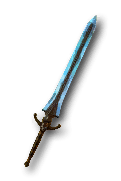 |
| **한아비** *(The Grandfather)* | 양손검 | 야만용사, 강령술사 | **치명타 피해가 60%~100%[x] 곱연산 증가**, 무기 내구도 무제한 | 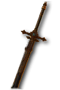 |
| **안다리엘의 두개골** *(Andariel's Visage)* | 투구 | 모든 직업 | 적중 시 일정 확률로 **독성 신성 폭발**, 공격 속도 및 생명력 흡수 대폭 증가 |  |
| **녹아내린 셀리그의 심장** *(Melted Heart of Selig)* | 목걸이 | 모든 직업 | 최대 자원 대폭 증가, **피해를 입을 때 생명력 대신 자원(마나/분노 등)이 소모** | 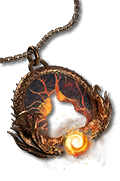 |
| **거짓 죽음의 수의** *(Shroud of False Death)* | 가슴 | 모든 직업 | 모든 패시브 기술 등급 상승, 은신 상태에서 벗어날 때 폭발적인 피해 증폭 |  |
| **파멸의 후예** *(Heir of Perdition)* | 투구 | 모든 직업 | 지속 피해 및 취약 피해 극대화, 정예 처치 시 악마의 힘 획득 | 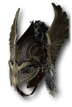 |
| **아발리온 - 라이칸더의 창** *(Ahavarion Spear of Lycander)* | 양손지팡이 | 원소술사, 드루이드 | 정예 처치 시 무작위 **신단 효과 10~20초간 획득** | 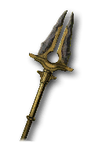 |

---

### 4.2 🏆 시즌 15 유산 고유 아이템 9종 (디아블로 30주년 기념)

| 아이템명 | 부위 | 착용 클래스 | 핵심 고유 효과 | 썸네일 |
|---|---|---|---|:---:|
| **레오릭의 왕관** *(Leoric's Crown)* | 투구 | 모든 직업 | 소켓에 장착된 보석 및 **영혼 가시(Soul Splinter) 효과 35%~100% 증폭** |  |
| **천벌의 팔보호구** *(Nemesis Bracers)* | 장갑 | 모든 직업 | **신단(Shrine) 활성화 시 즉시 정예 악마 무리 소환**, 정예 처치 후 이속 증가 |  |
| **요르단의 반지** *(Stone of Jordan)* | 반지 | 모든 직업 | 모든 원소 저항력을 **가장 높은 저항 수치로 동기화** 및 해당 원소 피해 대폭 곱연산 |  |
| **소의 채끝살** *(Sirloin of the Bovine)* | 바지 | 모든 직업 | 젖소방 테마 고유 바지. 독특한 유틸리티 생존 효과 및 방어도 증가 |  |
| **인검** *(In-Geom)* | 한손검 | 전 직업 (드루/도적/야만/원소 등) | **정예 적 무리 처치 시 모든 기술의 재사용 대기시간 15초 감소** | 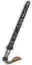 |
| **용광로** *(The Furnace)* | 양손철퇴 | 야만, 드루, 강령 | **정예 적 및 우두머리에게 주는 피해 최대 50%[x] 증가** |  |
| **아리옥의 바늘** *(Arioc's Needle)* | 양손미늘창 | 야만용사, 드루이드, 혼령사 | 치명적인 독 피해 부여 및 중독된 대상 공격 시 모든 기술 등급 대폭 상승 |  |
| **앙리의 쥐잡이** *(Henri's Perquisition)* | 보조무기 | 원소술사, 강령술사 | 피격 시 **첫 공격 피해를 60% 경감**하고 공격자를 매혹(Charm) 상태로 변환 | 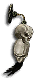 |
| **메서슈미트의 도끼** *(Messerschmidt's Reaver)* | 양손도끼 | 야만, 드루, 강령 | 적 처치 시 100% 확률로 기술 재사용 대기시간 1초 즉시 감소 |  |

---

### 4.3 🛡️ 핵심 공용 및 직업별 선조 고유 아이템

#### 1) 공용 핵심 선조 고유
- 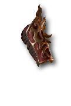 **운명의 주먹 (장갑)**: 공격 시 1%~300%의 무작위 피해를 주며, 행운의 적중 확률이 극단적으로 높아짐
- 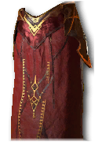 **티볼트의 의지 (바지)**: 저지 불가 상태 시 피해 20%~40%[x] 증가 및 주 자원 50 즉시 생성
-  **신살해자 왕관 (투구)**: 정예 적 기절/제압 시 주변 적을 흡인하고 주는 피해 최대 60%[x] 증가
-  **참회의 경갑 (장화)**: 지나간 자리에 서리를 남겨 적을 오한 상태로 만들고 오한 대상 추가 피해
-  **점멸걸음 (장화)**: 회피 시 궁극기 재사용 대기시간 최대 10초 감소 및 주는 피해 증가
- 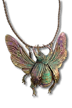 **추방당한 군주의 영약 (목걸이)**: 자원 소모 시 제압 극대화 피해 곱연산 증폭

#### 2) 야만용사 (Barbarian)
- 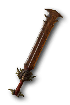 **라말라드니의 명작 (한손검)**: 보유한 분노 1당 주는 피해 0.1~0.3%[x] 증가, 매초 분노 소모
-  **강력한 조릿츠의 엄니투구 (투구)**: 광폭화 상태에서 광폭화 피해 증폭 및 공격 속도 대폭 증가
- 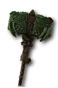 **과잉살상 (양손둔기)**: 죽음의 일격이 충격파를 발사하여 일직선상의 모든 적 분쇄
-  **심홍색 필드 (양손검)**: 파열 시 피의 웅덩이를 생성하여 출혈 피해 증폭

#### 3) 원소술사 (Sorcerer)
-  **무한의 의복 (가슴)**: 순간이동 시 주변 적을 내 앞으로 끌어당기고 2~3초간 기절시킴 (원소술사 필수 코어)
- 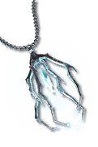 **파편화된 겨울유리 (목걸이)**: 얼음 보주 시전 시 무작위 구현 기술 자동 발동
- 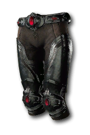 **축성 도관 (바지)**: 연쇄 번개가 몸을 맴돌며 지속적인 번개 폭풍 방출
-  **탈 라샤의 무지개색 고리 (반지)**: 주는 원소 피해 종류마다 피해 15~20%[x] 중첩 증가

#### 4) 강령술사 (Necromancer)
- 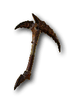 **검은 강 (한손낫)**: 시체 폭발이 주변 시체를 한 번에 최대 4구 추가 소모하여 폭발 범위 및 피해 극대화
- 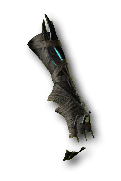 **크루오르의 포옹 (장갑)**: 피의 쇄도가 시체에서 추가 피 폭발을 일으키며 연쇄 제압 피해
-  **피 장인의 흉갑 (가슴)**: 피의 구슬을 일정 개수 획득할 때마다 무료 뼈 영혼 발사

#### 5) 도적 (Rogue)
- 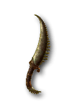 **규탄 (한손단검)**: 연계 점수 3점 소모 시 핵심 기술이 20~40%[x] 추가 피해를 주며 연계 점수 즉시 충전
-  **건달의 가죽옷 (가슴)**: 내부 시야 게이지 완충 시 모든 주입 기술 무료 발동 및 에너지 무한
-  **이름없는 자의 두건 (투구)**: 군중 제어 적 공격 시 행운의 적중 확률 대폭 증가

#### 6) 드루이드 (Druid)
-  **폭풍의 포효 (투구)**: 폭풍 기술이 행운의 적중 시 영력을 생성하고, **모든 폭풍 기술이 늑대인간 기술로 취급** (번개 늑대 필수)
-  **바실리의 기도 (투구)**: 대지 기술이 **곰인간 기술로 취급**되며 보강 획득
-  **돌멘 스톤 (목걸이)**: 회오리바람 시전 시 바위가 회오리바람 주위를 공전하며 적을 지속 분쇄

#### 7) 혼령사 (Spiritborn)
- 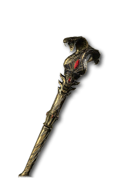 **케펠레케의 지팡이 (양손지팡이)**: 핵심 기술이 자원을 모두 소모하며 극대화 제압 피해 폭발적 증가
- 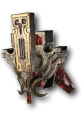 **에베와카의 화합 (투구)**: 혼령 수호자의 모든 원소 속성 피해 시너지 극대화
-  **한낮 사냥의 반지 (반지)**: 재규어 기술의 공격 속도 및 기력 회복 대폭 증가

---

## 5. 🌐 인터랙티브 웹 도감 (HTML) 사용 안내

위 모든 아이템을 **클래스별 / 장착 부위별 / 보스 드랍처별로 클릭 한 번에 필터링하고 검색**할 수 있는 웹 대도감입니다.

- 🔗 **GitHub Pages로 바로 보기**: [https://nimto.github.io/d4help/시즌15/선조-고유-아이템.html](https://nimto.github.io/d4help/시즌15/선조-고유-아이템.html)
- 🔗 **디렉토리 기본 주소**: [https://nimto.github.io/d4help/시즌15/](https://nimto.github.io/d4help/시즌15/)
- 🔗 **대체 미러 (Raw.Githack)**: [https://raw.githack.com/nimto/d4help/main/%EC%8B%9C%EC%A6%8C15/%EC%84%A0%EC%A1%B0-%EA%B3%A0%EC%9C%A0-%EC%95%84%EC%9D%B4%ED%85%9C.html](https://raw.githack.com/nimto/d4help/main/%EC%8B%9C%EC%A6%8C15/%EC%84%A0%EC%A1%B0-%EA%B3%A0%EC%9C%A0-%EC%95%84%EC%9D%B4%ED%85%9C.html)
